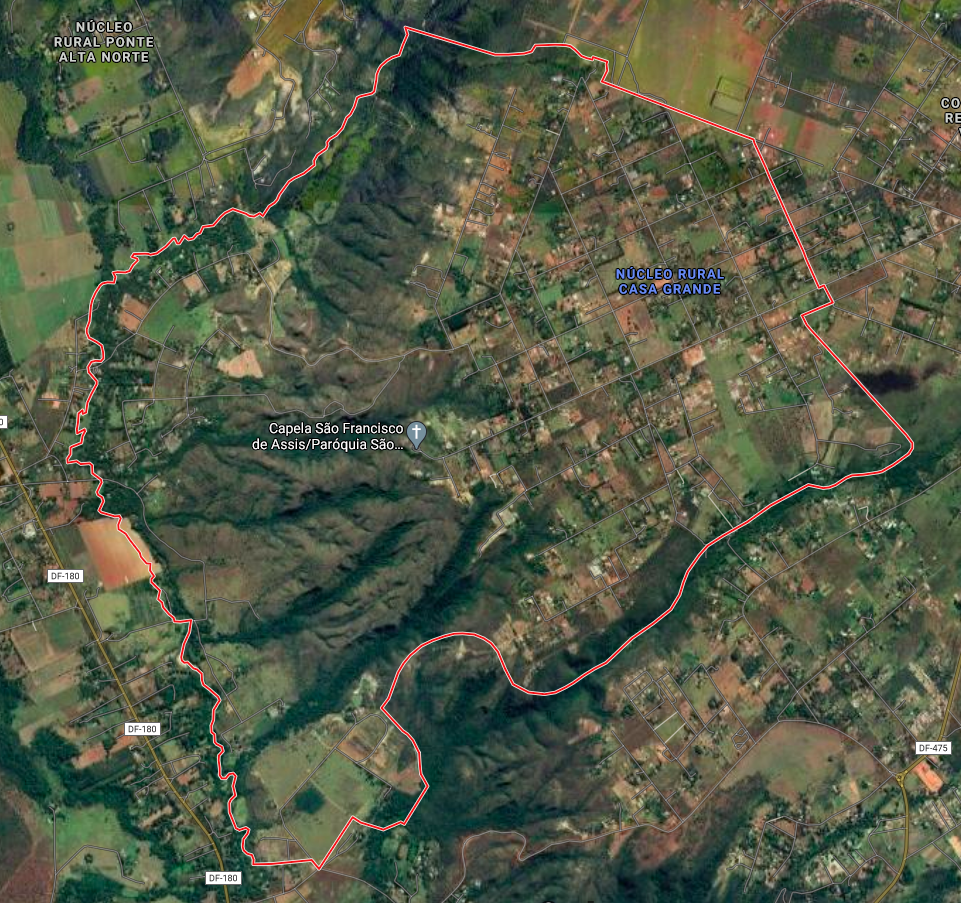
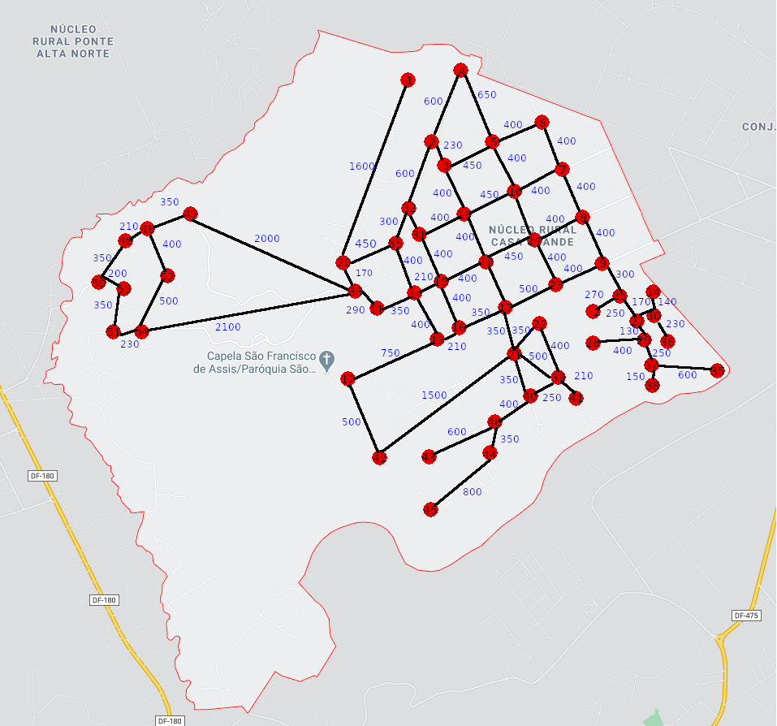

# Grafos2_FibraNRCG

**Número da Lista**: 2 
**Conteúdo da Disciplina**: Grafos2 

## Alunos
|Matrícula | Aluno |
| -- | -- |
| 18/0117548  |  [Bruno Carmo Nunes](https://github.com/brunocmo) |

## Video

https://youtu.be/urMF_XFnVng

## Sobre
A ideia do projeto é fazer uma distribuição de fibra óptica na região do Núcleo Rural da Casa Grande.

Onde pode se observar abaixo a implementação dos postes em cada esquina de ruas, fazendo então uma conexão econômica e de acesso a todos da região.
Mostrando no final o mapa e o total de metros de cabo.

## Screenshots

## Instalação
**Linguagem**: C++ 

Feito e usado no kernel: **Linux 5.4.0-45-generic x86_64**

Tenha o *git*, *make* e o compilador *c++* versão C++11 instalado na sua maquina.
De preferência, para não ocorrer problemas, use o Ubuntu.

Para clonar:

`git clone https://github.com/projeto-de-algoritmos/Grafos2_FibraNRCG.git`

Para compilar o programa:

`make`

Para executar o programa:

`make run`

Para limpar os arquivos .o e bin do programa:

`make clean`

## Uso
Primeiro compile o programa com o `make` e depois execute o programa com `make run` , vai apresentar-se na tela inicial um menu, onde o usuário pode escolher imprimir o mapa, gerar o mapa com um nó inicial, fazer a mudança de distância entre os nós e limpar o mapa.

Para gerar o mapa basta pressionar a opção 2 e escolher um nó do mapa. Como resultado irá a aparecer as conexõe em azul e no final o tamanho de metros da fibra óptica.

Na opção 3, você pode fazer a mudança de distâncias entre os nós, onde cada mudança pode gerar um mapa diferente do que visto. Especificamente para gerar mudanças, tente reduzir as distâncias já mencionadas na imagem. Como por exemplo o nó 10 e o nó 24 pode ser reduzido para um valor de 100 metros. Com essa mudança outro mapa será gerado, com a distância no final.

Por fim a opção 0 para sair do programa.

## Outros
Quando executar o programa no CLI, use-o em tela cheia para melhor aproveitamento do mesmo.
